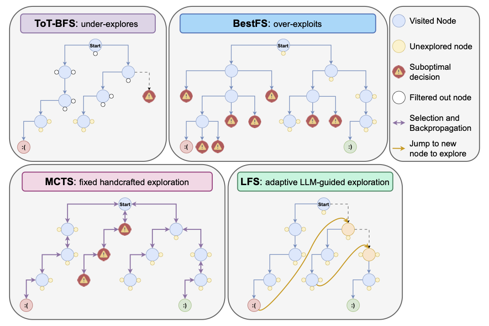

# 🧠 LLM-First Search (LFS): Self-Guided Search with Language Models

This repository accompanies our paper introducing **LLM-First Search (LFS)**, a novel self-guided search method that empowers Large Language Models (LLMs) to autonomously navigate and control the search process during problem-solving.

Unlike traditional search strategies that rely on fixed heuristics or hand-tuned exploration parameters (e.g., MCTS, BFS, BestFS), LFS puts the LLM in charge: the model itself decides whether to continue down a path or explore alternatives, guided by its own internal reasoning.

LFS enables **more flexible, efficient, and adaptive reasoning** without the need for manual hyperparameter tuning or domain-specific search strategies. It is especially effective for tasks that vary in difficulty or require dynamic compute allocation.

We evaluate LFS on two reasoning-intensive domains, **Countdown** and **Sudoku**, and compare it against three popular search-based approaches:

* Tree-of-Thoughts' **Breadth-First Search (ToT-BFS)**
* **Best-First Search (BestFS)**
* **Monte Carlo Tree Search (MCTS)**

<div align="center">
  
</div>

## 🔍 Key Results

* ✅ Outperforms traditional search strategies on **harder tasks** without tuning.
* ⚡ Achieves **greater computational efficiency**, especially with stronger LLMs.
* 📈 **Scales better** with model size and compute budget, benefiting from its LLM-centric design.

### WinRate (%) Across All Tasks

| Model    | Method                                         | Diff 3       | Diff 5       | Diff 7       | 4x4         | 6x6         |
|----------|------------------------------------------------|--------------|--------------|--------------|-------------|-------------|
| GPT-4o   | <span style="color:#AA4499"><b>ToT-BFS</b></span>       | 82.11        | 9.47         | 0.00         | 53.68       | 0.00        |
|          | <span style="color:#88CCEE"><b>BestFS</b></span>        | **100.00**   | 49.47        | 11.11        | 41.05       | 0.00        |
|          | <span style="color:#CC6677"><b>MCTS (c=0.5)</b></span>  | **100.00**   | 60.00        | 32.63        | **100.00**  | 0.00        |
|          | <span style="color:#AA4499"><b>MCTS (c=1.0)</b></span>  | **100.00**   | 62.22        | 33.33        | 2.22        | 0.00        |
|          | <span style="color:#882255"><b>MCTS (c=2.5)</b></span>  | **100.00**   | 60.00        | 24.44        | 0.00        | 0.00        |
|          | <span style="color:#44AA99"><b>LFS (ours)</b></span>    | **100.00**   | **63.16**    | **47.37**    | 96.84       | **2.22**    |
| o3-mini  | <span style="color:#88CCEE"><b>BestFS</b></span>        | --           | 52.63        | 13.33        | 61.05       | 0.00        |
|          | <span style="color:#CC6677"><b>MCTS (c=0.5)</b></span>  | --           | 69.47        | 41.05        | 90.53       | 4.21        |
|          | <span style="color:#44AA99"><b>LFS (ours)</b></span>    | --           | **70.53**    | **78.95**    | **96.84**   | **25.26**   |

### Area Under the Performance Profile (AUP)

| Metric          | Model    | <span style="color:#AA4499"><b>ToT-BFS</b></span> | <span style="color:#88CCEE"><b>BestFS</b></span> | <span style="color:#CC6677"><b>MCTS (c=0.5)</b></span> | <span style="color:#44AA99"><b>LFS (ours)</b></span> |
|-----------------|----------|------------------|------------------|----------------------------|----------------------------|
| WinRate         | GPT-4o   | 4.06             | 5.98             | 7.09                       | **8.99**                   |
|                 | o3-mini  | --               | 4.23             | 6.00                       | **7.20**                   |
| EfficiencyScore | GPT-4o   | 3.68             | 2.67             | 3.68                       | **4.70**                   |
|                 | o3-mini  | --               | 3.24             | 5.61                       | **7.20**                   |

## 🚀 Quick Start

```bash
# —— Option 1: Using Conda —— #
# Create & activate a Conda environment
conda create -n llmfirst python pip
conda activate llmfirst

# Install dependencies
pip install -r requirements.txt


# —— Option 2: Using pip + venv —— #
# Create & activate a virtual environment
python3 -m venv llmfirst
source llmfirst/bin/activate      # On Windows: llmfirst\Scripts\activate

# Upgrade pip and install dependencies
pip install --upgrade pip
pip install -r requirements.txt
```

### Environment Setup

Create a `.env` file in the project root directory with your OpenAI API key:

```bash
# Create .env file
touch .env

# Add your OpenAI API key to the .env file
echo "OPENAI_API_KEY=your_openai_api_key_here" >> .env
```

**Note:** Replace `your_openai_api_key_here` with your actual OpenAI API key. Make sure to keep this file secure and never commit it to version control.

## 📊 Data Generation

> **📌 Note**: This project already includes the datasets used to generate the results presented in our paper. You can immediately proceed to the [🔬 Reproducing Paper Results](#-reproducing-paper-results) section to reproduce our results. The data generation instructions below are only needed if you want to create new datasets with different parameters or sample sizes.

### Countdown Data Generation

Generate Countdown puzzles with the following command:

```bash
python -m src.generators.countdown_generate \
    --seed 42 \
    --data_dir ./data/countdown/ \
    --list_length 3 \
    --max_target 100 \
    --num_samples 1000 \
    --val_ratio 0.2 \
    --check_duplicates
```

The script will generate:

* Training and validation sets split according to `val_ratio`
* Each sample includes starting numbers, target number, solution, and complexity score
* Files are saved as JSON in the specified data directory

Example of a single Countdown puzzle data structure:

```json
{
  "nums": [60, 96, 84, 22, 5, 26, 30],
  "target": 75,
  "solution": [
    "60+96=156",
    "84+22=106",
    "30-5=25",
    "156/26=6",
    "106-25=81",
    "81-6=75"
  ],
  "complexity": 0.6,
  "optimal_path": "...trace...",
  "start_size": 7
}
```

### Sudoku Data Generation

Generate Sudoku puzzles with the following command:

```bash
python -m src.generators.sudoku_generator \
    --difficulty expert \
    --width 3 \
    --height 3 \
    --number 100 \
    --show-solutions 0 \
    --output ./data/sudoku/ \
    --save 1
```

The script will generate:

* Puzzles with unique solutions
* Different difficulty levels affect the number of empty cells
* Files are saved as pickle files in the specified output directory
* Each puzzle includes the board state and solution

Example of a Sudoku puzzle and its solution:

```
# Example 6x6 Sudoku puzzle (width=2, height=3)
Puzzle:
[
    [None, 3, None, 1, None, None],
    [1, None, None, None, None, None],
    [None, None, 3, None, None, 2],
    [None, None, None, None, None, None],
    [None, 2, None, 6, None, None],
    [6, 1, None, 4, None, 5]
]

Solution:
[
    [2, 3, 6, 1, 5, 4],
    [1, 5, 4, 2, 6, 3],
    [4, 6, 3, 5, 1, 2],
    [5, 4, 1, 3, 2, 6],
    [3, 2, 5, 6, 4, 1],
    [6, 1, 2, 4, 3, 5]
]
```

## 🌎 Game Architecture

The codebase is modular and designed for easy extension to new games. It currently supports two games with dedicated modules:

### Game Modules

* **`countdown_game`**: Contains Countdown-specific node and agent implementations. Utilities are in **`utils.countdown_utils`**.
* **`sudoku_game`**: Contains Sudoku-specific node and agent implementations. Utilities are in **`utils.sudoku_utils`**.

### Node Types

Each game defines a custom node type that inherits from a common **`GameNode`** base class, ensuring all node types implement a consistent interface required by the search algorithms.

### Game-Specific Agents

Each game includes an agent inheriting from **`BaseAgent`**, using **`BaseInstructions`** for prompt handling. These agents manage:

* API calls to LLMs
* Prompt formatting and parsing
* Game state transitions
* Move generation and validation

This modular structure allows new games to be added with minimal changes to the search logic.

### Search Algorithms

Search strategies are implemented in separate files with game-specific run logic:

* **`llm_first_search.py`**: LLM-First Search
* **`llm_mcts.py`**: Monte Carlo Tree Search
* **`llm_bestfs.py`**: Best-First Search
* **`llm_tot_bfs.py`**: Tree-of-Thoughts BFS

Each script contains a `run` function tailored to the game domain, maintaining a unified interface across algorithms.

## 🔮 Running Experiments

### Countdown Example

```bash
./scripts/run_game_batches.sh countdown mcts \
    --data-dir ./data/countdown \
    --output-dir ./data/countdown/results \
    --conda-env llmfirst \
    --model-type openai \
    --model-name o3-mini \
    --reasoning 1 \
    --split val \
    --countdown-difficulty 3 \
    --num-batches 1 \
    --max-token-usage 10000 \
    --timeout 300 \
    --num-its 1 \
    --batch-size 1 \
    --session-prefix game
```

### Sudoku Example

```bash
./scripts/run_game_batches.sh sudoku lfs \
    --data-dir ./data/sudoku \
    --output-dir ./data/sudoku/results \
    --conda-env llmfirst \
    --model-type openai \
    --model-name gpt-4o \
    --reasoning 0 \
    --sudoku-difficulty medium \
    --sudoku-size 4 \
    --sudoku-width 2 \
    --sudoku-height 2 \
    --num-batches 1 \
    --max-token-usage 10000 \
    --timeout 300 \
    --num-its 1 \
    --batch-size 1 \
    --session-prefix game
```

## 📊 Analysis

After running experiments, you can analyze the results using the included analysis script. The script automatically detects available methods and tasks from your result directories and generates comprehensive comparisons including **AUP (Area Under Performance Profile)** calculations.

### Basic Analysis

```bash
# Auto-detect all methods and tasks
python src/simple_analysis.py \
    --data_dir ./data/countdown/results \
    --output_dir ./analysis/countdown

# Analyze specific model
python src/simple_analysis.py \
    --data_dir ./data/sudoku/results \
    --output_dir ./analysis/sudoku \
    --model gpt-4o

# Include only specific methods
python src/simple_analysis.py \
    --data_dir ./data/countdown/results \
    --output_dir ./analysis/countdown \
    --methods "mcts,bestfs,lfs"
```

### Generated Outputs

The analysis script automatically generates:

#### 📈 Visualizations
* **`win_rates.png`**: Bar chart comparing win rates across methods and tasks
* **`token_usage.png`**: Bar chart comparing average token usage across methods
* **`efficiency.png`**: Scatter plot showing win rate vs token usage (efficiency analysis)
* **`aup_values.png`**: Bar chart comparing AUP (Area Under Performance Profile) metrics

#### 📋 Summary Tables
* **`summary.xlsx`**: Multi-sheet Excel file with detailed metrics and AUP values
  - **Results sheet**: Win rates, token usage, and basic metrics
  - **AUP Values sheet**: Area Under Performance Profile calculations
* **`summary.csv`**: CSV version of the main results data
* **`aup_summary.csv`**: Standalone CSV with AUP calculations

#### 🖥️ Console Output
The script prints a detailed summary to the console including AUP values:

```
📊 SUMMARY:
================================================================================

Countdown (diff=3):
----------------------------------------
  mcts        : 85.0% win rate, 1250 tokens
  bestfs      : 78.0% win rate, 950 tokens
  lfs         : 92.0% win rate, 1100 tokens
  tot_bfs     : 70.0% win rate, 1400 tokens

Sudoku (4x4, medium):
----------------------------------------
  mcts        : 60.0% win rate, 2100 tokens
  bestfs      : 55.0% win rate, 1800 tokens
  lfs         : 75.0% win rate, 1900 tokens

📊 AUP VALUES:
================================================================================
  mcts        : Win Rate AUP = 6.234, Efficiency Score AUP = 4.567
  bestfs      : Win Rate AUP = 5.123, Efficiency Score AUP = 3.789
  lfs         : Win Rate AUP = 7.456, Efficiency Score AUP = 6.234
  tot_bfs     : Win Rate AUP = 4.567, Efficiency Score AUP = 3.123
```

### Key Metrics

The analysis automatically computes and compares:

* **Win Rate**: Percentage of games solved successfully
* **Token Usage**: Average number of tokens consumed per game
* **Efficiency**: Win rate relative to computational cost
* **Game Coverage**: Number of games attempted and solved
* **Win Rate AUP**: Measures how consistently a method performs well across tasks
* **Efficiency Score AUP**: Combines win rate and token efficiency for overall performance assessment

### Analysis Tips

* Run analysis on specific subsets using the `--methods` parameter to focus comparisons
* Compare the same model across different tasks to understand method strengths
* Use the efficiency plots to identify methods that achieve good win rates with lower token costs
* **Check AUP values** to identify methods with the most consistent performance across diverse tasks
* The Excel output provides detailed breakdowns for further statistical analysis
* **AUP metrics are especially useful** for comparing methods across heterogeneous task sets

## 🔬 Reproducing Paper Results

### Countdown

```bash
./scripts/run_game_batches.sh countdown {method_name} \
    --data-dir ./data/countdown \
    --output-dir ./results \
    --conda-env llmfirst \
    --model-type openai \
    --model-name {model_name} \
    --reasoning {reasoning_model} \
    --split val \
    --countdown-difficulty {game_diff} \
    --num-batches 20 \
    --max-token-usage {max_token_usage} \
    --timeout 300 \
    --num-its 5 \
    --batch-size 1 \
    --session-prefix game
```

| Parameter         | Values                                       | Notes                                                      |
|-------------------|----------------------------------------------|------------------------------------------------------------|
| `game_diff`       | 3, 5, 7                                      | Countdown difficulty level                                  |
| `max_token_usage` | 1000000                                      | Max tokens allowed per run                                  |
| `model_name`      | `gpt-4o` (non-reasoning model), `o3-mini` (reasoning model) | `gpt-4o` **does not** use the reasoning module; `o3-mini` **uses** the reasoning module |
| `reasoning_model` | 0 (disabled), 1 (enabled)                    | Whether reasoning is enabled (should be 0 for `gpt-4o`, 1 for `o3-mini`) |
| `method_name`     | `lfs`, `mcts`, `bestfs`, `tot_bfs`           | Search method to run                                        |

### Sudoku

```bash
./scripts/run_game_batches.sh sudoku {method_name}\
    --data-dir ./data/sudoku \
    --output-dir ./results \
    --conda-env llmfirst \
    --model-type openai \
    --model-name {model_name} \
    --reasoning {reasoning_model} \
    --sudoku-difficulty {sudoku_diff} \
    --sudoku-size {sudoku_size} \
    --sudoku-width {sudoku_width}  \
    --sudoku-height {sudoku_height} \
    --num-batches 20 \
    --max-token-usage {max_token_usage} \
    --timeout 300 \
    --num-its 5 \
    --batch-size 1 \
    --session-prefix game
```

| Parameter         | Values                               | Notes                                                      |
|-------------------|--------------------------------------|------------------------------------------------------------|
| `sudoku_size`     | 4, 6                                 | Sudoku grid size (e.g., 4x4, 6x6)                         |
| `sudoku_width`    | 2                                   | Width of each Sudoku block                                 |
| `sudoku_height`   | 2 (for size 4), 3 (for size 6)       | Height of each Sudoku block                                |
| `sudoku_difficulty`| `hard` (size 4), `medium` (size 6)  | Difficulty level of Sudoku puzzles                         |
| `max_token_usage` | 100000 (size 4), 500000 (size 6)    | Max tokens allowed per run                                 |
| `model_name`      | `gpt-4o` (non-reasoning), `o3-mini` (reasoning) | `gpt-4o` disables reasoning (0), `o3-mini` enables (1)    |
| `reasoning_model` | 0 (disabled), 1 (enabled)            | Whether reasoning is enabled (0 for `gpt-4o`, 1 for `o3-mini`) |
| `method_name`     | `lfs`, `mcts`, `bestfs`, `tot_bfs`  | Search method to run                                       |

### Analysis

To generate a comparable analysis, run the following commands. Note that the results have been simplified for easier comparison but still retain enough detail for meaningful evaluation.
#### GPT-4o

```bash
python src/simple_analysis.py \
    --data_dir ./results \
    --output_dir ./analysis/gpt4o \
    --model gpt-4o \
    --methods "tot_bfs,bestfs,mcts,lfs"
```

#### o3-mini

```bash
python src/simple_analysis.py \
    --data_dir ./results \
    --output_dir ./analysis/o3mini \
    --model o3-mini \
    --methods "bestfs,mcts,lfs"

```